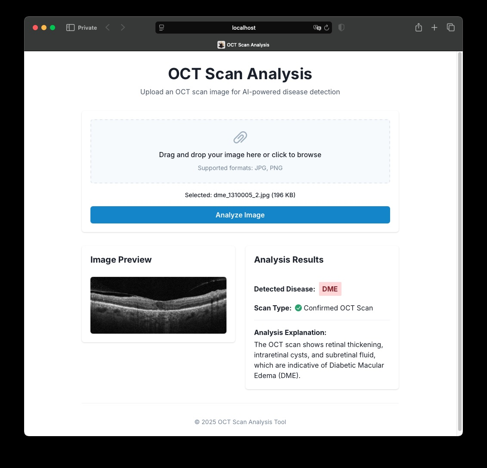

# OCT AI

Classify your OCT scans with AI. The app uses Google's Gemini API to classify and explain the scans. You need to obtain an API key from [AI Studio](https://aistudio.google.com) to use the app (for low requests frequency it is available for free).



## How to run?

Before running create a `.env` file inside `backend` directory with the following content:

```bash
GOOGLEAI_API_KEY=...
PORT=8080  # optional, can be used if you want to run the backend on a different port
```

#### Docker compose
```
docker compose up
```

#### Locally

Make sure you have Go >= 1.23 and Node.js >=22 installed.

```
# Backend
cd backend
go run .

# Frontend
cd frontend
npm i
npm run dev
```
